| Ziddan makarim | 312010063 |
| ---------------|-----------|
| TI.20 A.1      | Lab4Web   |

## 1). Membuat Box Element
### Hasil

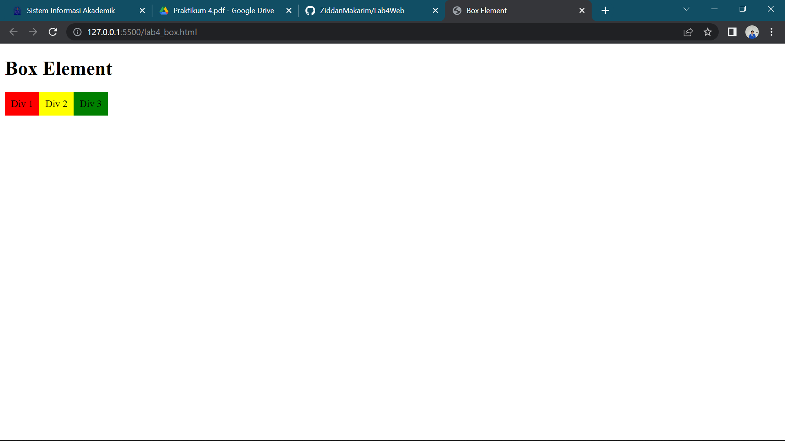

Disini saya telah membuat box element dengan tag div dan juga dengan CSS FLOAT PROPERTY

### Contoh Coding
```html
<!DOCTYPE html>
<html lang="en">

<head>
    <meta charset="UTF-8">
    <meta http-equiv="X-UA-Compatible" content="IE=edge">
    <meta name="viewport" content="width=device-width, initial-scale=1.0">
    <title>Box Element</title>
    <style>
        div {
        float:left;
        padding: 10px;
        }
        .div1 {
        background: red;
        }
        .div2 {
        background: yellow;
        }
        .div3 {
        background: green;
        }
        </style>
</head>

<body>
    <header>
        <h1>Box Element</h1>
    </header>
    <section>
        <div class="div1">Div 1</div>
        <div class="div2">Div 2</div>
        <div class="div3">Div 3</div>
    </section>
</body>

</html>
```

## 2). Mengatur Clearfix Element
### Hasil

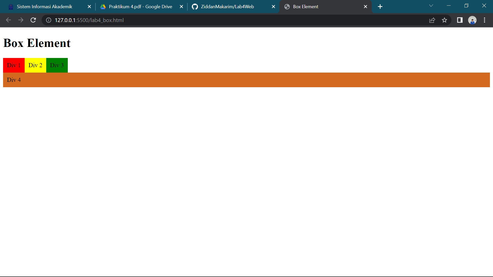

Menambahkan element tag div dan juga css clear yang kemuadian floatnya di none.

### Contoh Coding
```html
 <div class="div4">Div 4</div>
```

```css
       .div4 {
            background-color: chocolate;
            clear: left;
            float: none;
         }     
```

## 3). Membuat Kerangka Layout
### Hasil

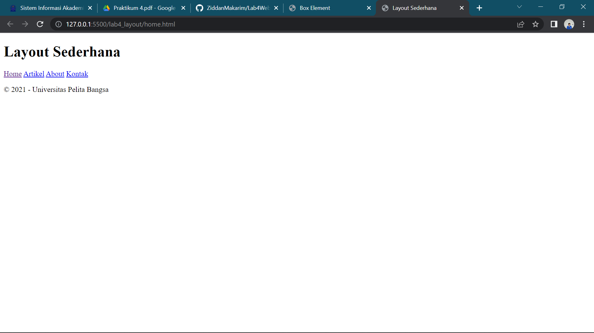

Disini saya membuat kerangka layout sederhana

### Contoh Coding
```html
<!DOCTYPE html>
<html lang="en">

<head>
    <meta charset="UTF-8">
    <meta http-equiv="X-UA-Compatible" content="IE=edge">
    <meta name="viewport" content="width=device-width, initial-scale=1.0">
    <title>Layout Sederhana</title>
</head>

<body>
    <div id="container">
        <header>
            <h1>Layout Sederhana</h1>
        </header>
        <nav>
            <a href="home.html" class="active">Home</a>
            <a href="artikel.html">Artikel</a>
            <a href="about.html">About</a>
            <a href="kontak.html">Kontak</a>
        </nav>
        <section id="hero"></section>
        <section id="wrapper">
            <section id="main"></section>
            <aside id="sidebar"></aside>
        </section>
        <footer>
            <p>&copy; 2021 - Universitas Pelita Bangsa</p>
        </footer>
    </div>
</body>

</html>
```

## 4). Menambahkan CSS Layout
### Hasil
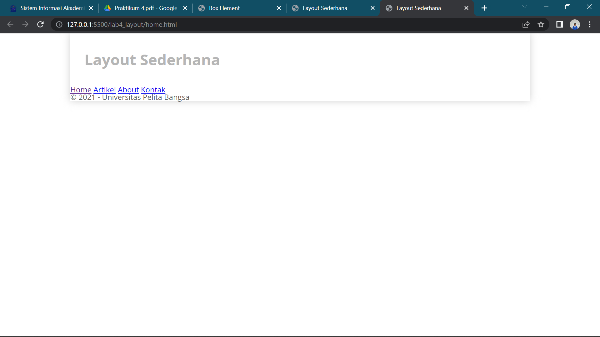

Disini saya menambahkan CSS Layout pada CSS Eksternal

### Contoh Coding
```css
/* import google font */
@import
url('https://fonts.googleapis.com/css2?family=Open+Sans:ital,wght@0,300;0,400;0,600;0,700;0,800;1,300;1,400;1,600;1,700;1,800&display=swap');
@import
url('https://fonts.googleapis.com/css2?family=Open+Sans+Condensed:ital,wght@0,300;0,700;1,300&display=swap');
/* Reset CSS */
* {
    margin: 0;
    padding: 0;
    }
    body {
    line-height:1;
    font-size:100%;
    font-family:'Open Sans', sans-serif;
    color:#5a5a5a;
    }
    #container {
    width: 980px;
    margin: 0 auto;
    box-shadow: 0 0 1em #cccccc;
    }
    /* header */
    header {
    padding: 20px;
    }
    header h1 {
    margin: 20px 10px;
    color: #b5b5b5;
    }
```

## 5). Membuat Navigasi
### Hasil

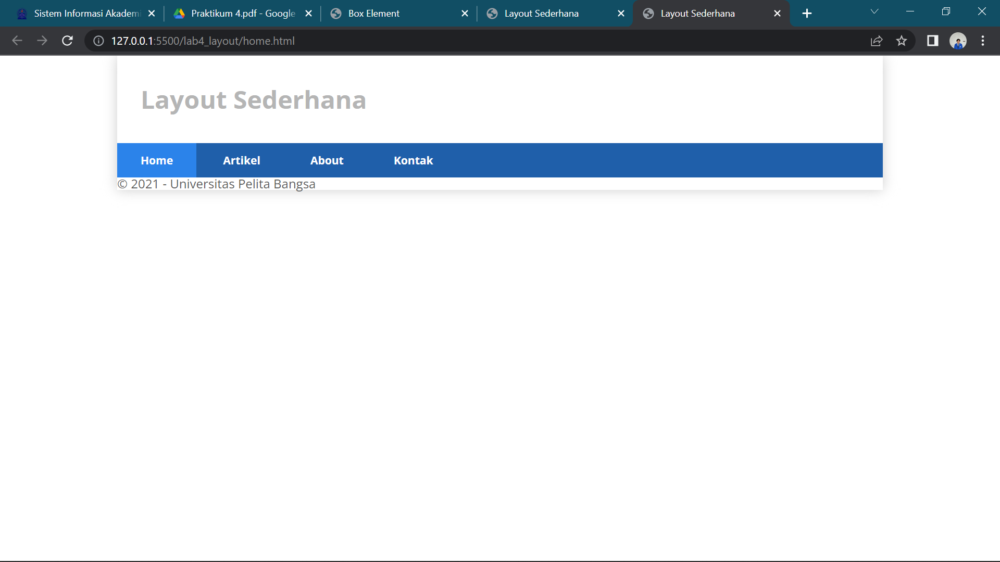

Disini saya menambahkan navigasi pada CSS

### Contoh Coding
```css
/* navigasi */
nav {
    display: block;
    background-color: #1f5faa;
    }
    nav a {
    padding: 15px 30px;
    display: inline-block;
    color: #ffffff;
    font-size: 14px;
    text-decoration: none;
    font-weight: bold;
    }
    nav a.active,
    nav a:hover {
    background-color: #2b83ea;
    }
```

## 6). Membuat Hero Panel
### Hasil

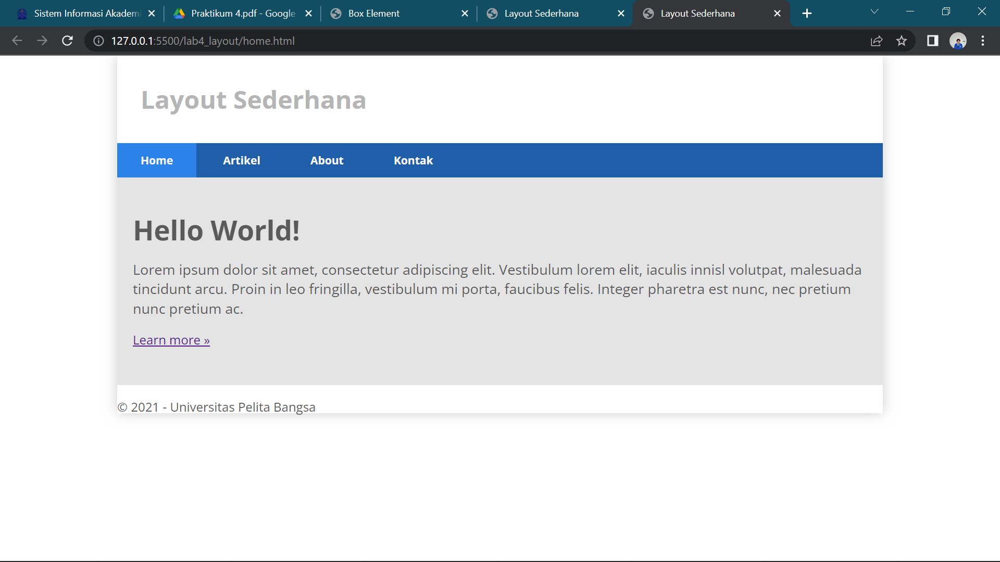

Disini saya membuat Hero Panel

### Contoh Coding
```css
 /* Hero Panel */
#hero {
    background-color: #e4e4e5;
    padding: 50px 20px;
    margin-bottom: 20px;
    }
    #hero h1 {
    margin-bottom: 20px;
    font-size: 35px;
    }
    #hero p {
    margin-bottom: 20px;
    font-size: 18px;
    line-height: 25px;
    }
```

## 7). Mengatur Layout Main dan Sidebar

Disini saya sudah mengatur layout main dan sidebar

### Contoh Coding
```css
 /* main content */
#wrapper {
    margin: 0;
    }
    #main {
        float: left;
        width: 640px;
        padding: 20px;
        }
        /* sidebar area */
        #sidebar {
        float: left;
        width: 260px;
        padding: 20px;
        }
```

## 8). Membuat Sidebar Widget
### Hasil

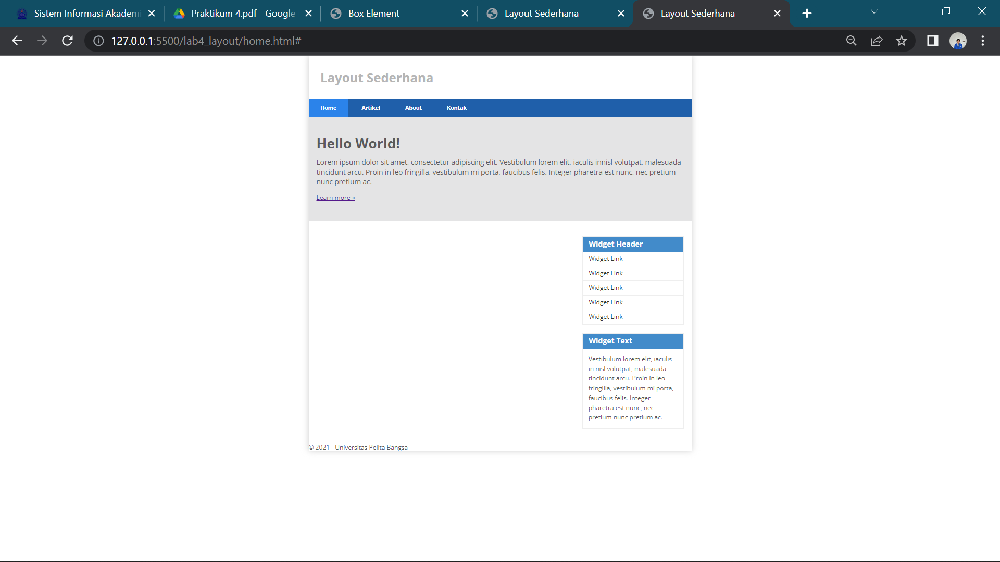

Menambahkan sidebar widget pada html dan css

### Contoh Coding
```html
 <aside id="sidebar">
                <div class="widget-box">
                    <h3 class="title">Widget Header</h3>
                    <ul>
                        <li><a href="#">Widget Link</a></li>
                        <li><a href="#">Widget Link</a></li>
                        <li><a href="#">Widget Link</a></li>
                        <li><a href="#">Widget Link</a></li>
                        <li><a href="#">Widget Link</a></li>
                    </ul>
                </div>
                <div class="widget-box">
                    <h3 class="title">Widget Text</h3>
                    <p>Vestibulum lorem elit, iaculis in nisl volutpat, malesuada tincidunt
                        arcu. Proin in leo fringilla, vestibulum mi porta, faucibus felis. Integer
                        pharetra est nunc, nec pretium nunc pretium ac.</p>
                </div>
            </aside>
```

```css
/* widget */
.widget-box {
    border:1px solid #eee;
    margin-bottom:20px;
    }
    .widget-box .title {
    padding:10px 16px;
    background-color:#428bca;
    color:#fff;
    }
    .widget-box ul {
    list-style-type:none;
    }
    .widget-box li {
    border-bottom:1px solid #eee;
}
.widget-box li a {
padding:10px 16px;
color:#333;
display:block;
text-decoration:none;
}
.widget-box li:hover a {
background-color:#eee;
}
.widget-box p {
padding:15px;
line-height:25px;
}
```

## 9). Mengatur Footer
### Hasil

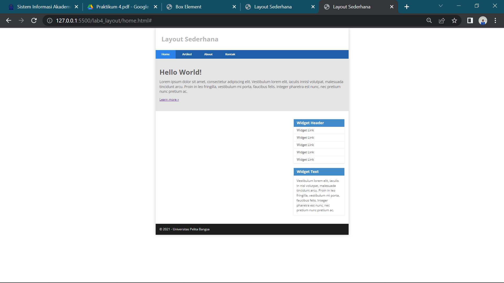

Disini saya menambahkan footer pada bagian css

### Contoh Coding
```css
/* footer */
footer {
    clear:both;
    background-color:#1d1d1d;
    padding:20px;
    color:#eee;
    }
```

## 10). Menambahkan Element Pada Main Content
### Hasil

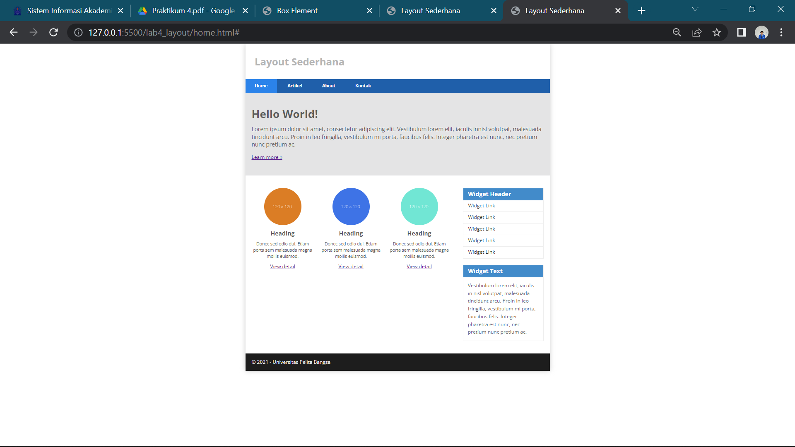

Disini saya telah menambahkan element pada main content

### Contoh Coding
```html
<section id="main">
<div class="row">
<div class="box">

<h3>Heading</h3>
<p>Donec sed odio dui. Etiam porta sem malesuada magna mollis
euismod.</p>
<a href="#" class="btn btn-default">View detail</a>
</div>
<div class="box">

<h3>Heading</h3>
<p>Donec sed odio dui. Etiam porta sem malesuada magna mollis
euismod.</p>
<a href="#" class="btn btn-default">View detail</a>
</div>
<div class="box">

<h3>Heading</h3>
<p>Donec sed odio dui. Etiam porta sem malesuada magna mollis
euismod.</p>
<a href="#" class="btn btn-default">View detail</a>
</div>
</div>
</section>
```

```css
/* box */
.box {
display:block;
float:left;
width:33.333333%;
box-sizing:border-box;
-moz-box-sizing:border-box;
-webkit-box-sizing:border-box;
padding:0 10px;
text-align:center;
}
.box h3 {
margin: 15px 0;
}
.box p {
line-height: 20px;
font-size: 14px;
margin-bottom: 15px;
}
box img {
border: 0;
vertical-align: middle;
}
.image-circle {
border-radius: 50%;
}
.row {
margin: 0 -10px;
box-sizing: border-box;
-moz-box-sizing: border-box;
-webkit-box-sizing: border-box;
}
.row:after, .row:before,
.entry:after, .entry:before {
content:'';
display:table;
}
.row:after,
.entry:after {
clear:both;
}
```

## 11). Menambahkan Content Article
### Hasil

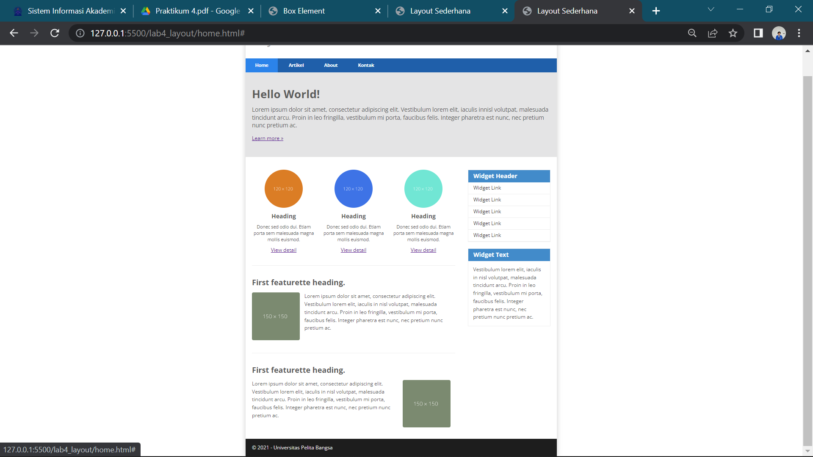

Disini saya menambahkan element dengan section article dan pada css nya

```html
<hr class="divider" />
                <article class="entry">
                    <h2>First featurette heading.</h2>
                    
                    <p>Lorem ipsum dolor sit amet, consectetur adipiscing elit. Vestibulum lorem
                        elit, iaculis in nisl volutpat, malesuada tincidunt arcu. Proin in leo fringilla,
                        vestibulum mi porta, faucibus felis. Integer pharetra est nunc, nec pretium nunc
                        pretium ac.</p>
                </article>
                <hr class="divider" />
                <article class="entry">
                    <h2>First featurette heading.</h2>
                    
                    <p>Lorem ipsum dolor sit amet, consectetur adipiscing elit. Vestibulum lorem
                        elit, iaculis in nisl volutpat, malesuada tincidunt arcu. Proin in leo fringilla,
                        vestibulum mi porta, faucibus felis. Integer pharetra est nunc, nec pretium nunc
                        pretium ac.</p>
                </article>
```

```css
.divider {
    border:0;
    border-top:1px solid #eeeeee;
    margin:40px 0;
    }
    /* entry */
    .entry {
    margin: 15px 0;
    }
    .entry h2 {
    margin-bottom: 20px;
}
.entry p {
line-height: 25px;
}
.entry img {
float: left;
border-radius: 5px;
margin-right: 15px;
}
.entry .right-img {
float: right;
}
```


## Pertanyaan Dan Tugas

## 1). Tambahkan Layout untuk menu About => buat single layout yang berisi deskripsi, portfolio, dll
### Jawaban 

```html
<!DOCTYPE html>
<html lang="en">
<head>
    <meta charset="UTF-8">
    <meta http-equiv="X-UA-Compatible" content="IE=edge">
    <meta name="viewport" content="width=device-width, initial-scale=1.0">
    <title>About Me</title>
    <link rel="stylesheet" href="style.css">
</head>
<body>
    <div id="container">
        <header>
            <h1>About Me</h1>
        </header>
        <nav>
            <a href="home.html" class="active">Home</a>
            <a href="artikel.html">Article</a>
            <a href="about.html">About</a>
            <a href="kontak.html">Contact</a>
        </nav>
        <section id="about">
            <div class="row">
                
                <h1>Ziddan Makarim</h1>
                <p>Nama saya Ziddan Makarim, Saya adalah seorang mahasiswa Universitas Pelita Bangsa,Jurusan Teknik Informatika kelas TI.20 A.1. Saya lahir di Bekasi,05 Januari 2003. dan saya juga sedang mempelajari html css js dan php sebagai jalan menuju front end developer</p>
            </div>
        </section>
        <footer>
            <p style="text-align: center;">Universitas Pelita Bangsa</p>
        </footer>
    </div>
</body>
</html>
```
---------------------------------------------------

## 2). Tambahkan layout untuk menu Contact => yang berisi form isian: nama, email, message, dll
### Jawaban
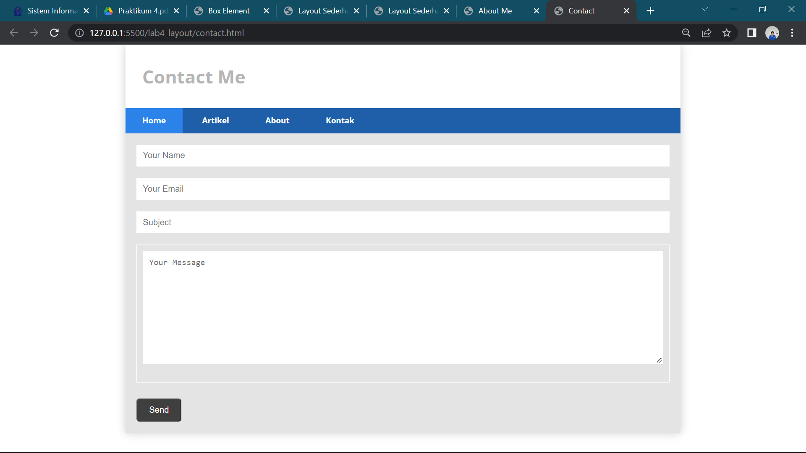
```html
<!DOCTYPE html>
<html lang="en">
<head>
    <meta charset="UTF-8">
    <meta http-equiv="X-UA-Compatible" content="IE=edge">
    <meta name="viewport" content="width=device-width, initial-scale=1.0">
    <title>Contact</title>
    <link rel="stylesheet" href="style.css">
</head>
<body>
    <div id="container">
        <header>
            <h1>Contact Me</h1>
        </header>
        <nav>
            <a href="home.html" class="active">Home</a>
            <a href="artikel.html">Artikel</a>
            <a href="about.html">About</a>
            <a href="kontak.html">Kontak</a>
        </nav>
        <section id="kontak">
            <div class="login">
               <input type="text" placeholder="Your Name" class="input">
               <input type="text" placeholder="Your Email" class="input">
            </div>
            <div class="subject">
                <input type="text" placeholder="Subject" class="input"> 
            </div>
            <div class="msg">
                <textarea name="Message" id="Message" cols="35" rows="10" class="area" class="input" placeholder="Your Message"></textarea>
            </div>
            <button type="submit">Send</button>
        </section>
    </div>
</body>
</html>
```

```css
/* Kontak Panel */
#kontak{
    background-color: #e4e4e5;
    padding: 20px 20px;
    margin-bottom: 20px;
}
.input,
.msg, .area{
    width: 100%;
    padding: 10px;
    border: 1px solid white;
    box-sizing: border-box;
    font-size: 15px;
    margin-bottom: 20px;
    
}
button{
    font-size: 15px;
    background-color: #3f3f3f;
    color: white;
    border-radius: 5px;
    padding: 10px 20px;
    margin-top: 8px;
}
button:hover{
    opacity: 0,9;
    background-color: #1f5faa;
}
```

# TERIMA KASIH